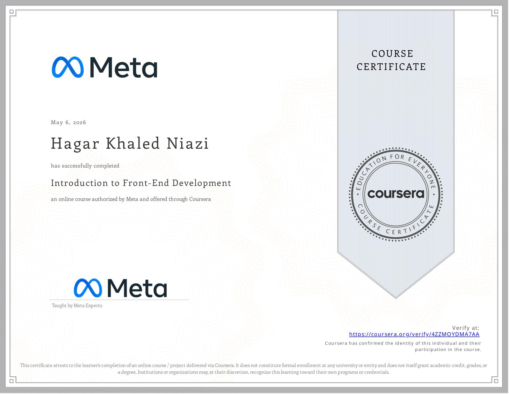

# Bootstrap Bio Page

A responsive personal bio page built as part of the **Meta Front-End Developer Professional Certificate**.

This project demonstrates the use of **HTML5** and **Bootstrap** to create a simple, responsive web page with personal information, favorite music artists, favorite films, and a profile link.

## 🎯 Project Overview

The goal of this project was to practice using Bootstrap's grid system and responsive utility classes to build a structured and responsive webpage.

The page includes:

* A personal name and profile image
* A list of favorite music artists
* A list of favorite films
* A Meta profile button
* Responsive layout using Bootstrap

## 🛠️ Technologies

* HTML5
* Bootstrap 5
* CSS

## 📱 Responsive Design

The page uses Bootstrap's responsive grid system:

* `container` for page layout
* `row` for organizing content
* `col-12` for mobile screens
* `col-lg-6` for larger screens
* `img-fluid` for responsive images

## 📂 Project Structure

```text
Project-graduation-course1/
├── index.html
├── photo.jpg
└── README.md
```

## 🚀 How to Run

1. Clone or download the repository.
2. Open the project folder in **VS Code**.
3. Open `index.html` in a browser.

You can also use the **Live Server** extension in VS Code for a better development experience.

## 🎓 Course

**Meta Front-End Developer Professional Certificate**

**Course 1 — Introduction to Front-End Development**

Status: ✅ Completed

## 📜 Certificate

Certificate of completion for **Course 1 — Introduction to Front-End Development**.



## 👩‍💻 Author

**Hagar Khaled Niazi**

Front-End Developer in progress.
