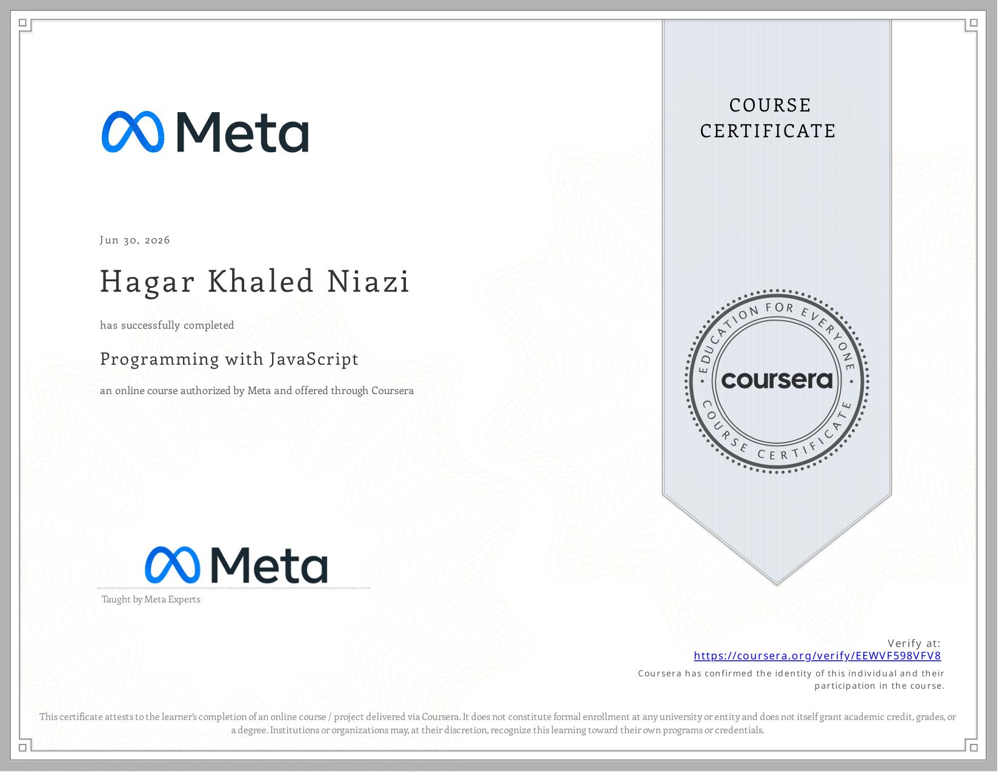

# Little Lemon Receipt Maker

A JavaScript-based receipt calculator built as part of the **Meta Front-End Developer Professional Certificate**.

This project focuses on practicing JavaScript functions, conditional statements, loops, parameters, arguments, data types, and working with arrays and objects.

## 🎯 Project Overview

The project simulates part of a restaurant receipt system for **Little Lemon**.

It uses a collection of dishes and calculates their final prices based on whether tax should be applied. It also calculates a discount based on the number of guests.

The project includes two main functions:

* `getPrices(taxBoolean)`
* `getDiscount(taxBoolean, guests)`

## 🍽️ Features

### Price Calculation

The `getPrices()` function:

* Iterates through the dish data
* Calculates prices with or without tax
* Displays each dish name and final price
* Validates the `taxBoolean` argument

### Discount Calculation

The `getDiscount()` function:

* Calls `getPrices()` first
* Validates the number of guests
* Applies a `$5` discount for fewer than 5 guests
* Applies a `$10` discount for 5 or more guests
* Validates that the number of guests is between 0 and 30

## 🛠️ Technologies

* JavaScript
* Node.js
* VS Code

## 📂 Project Structure

```text
Project-graduation-course2/
├── finalProject.js
└── README.md
```

## ▶️ How to Run

Make sure you have **Node.js** installed.

Open the project folder in **VS Code**, then open the terminal and run:

```bash
node finalProject.js
```

The program will display the calculated dish prices, discounts, and validation messages in the terminal.

## 🧠 Concepts Practiced

* JavaScript functions
* Function parameters and arguments
* `if / else` statements
* Boolean values
* `typeof`
* `for...of` loops
* Arrays
* Objects
* Template literals
* Input validation
* Calling functions with different arguments

## 🎓 Course

**Meta Front-End Developer Professional Certificate**

**Course 2 — Programming with JavaScript**

## 📜 Certificate

Certificate of completion for **Course 2 — Programming with JavaScript**.



Status: ✅ Completed

## 👩‍💻 Author

**Hagar Khaled Niazi**

Front-End Developer in progress.
