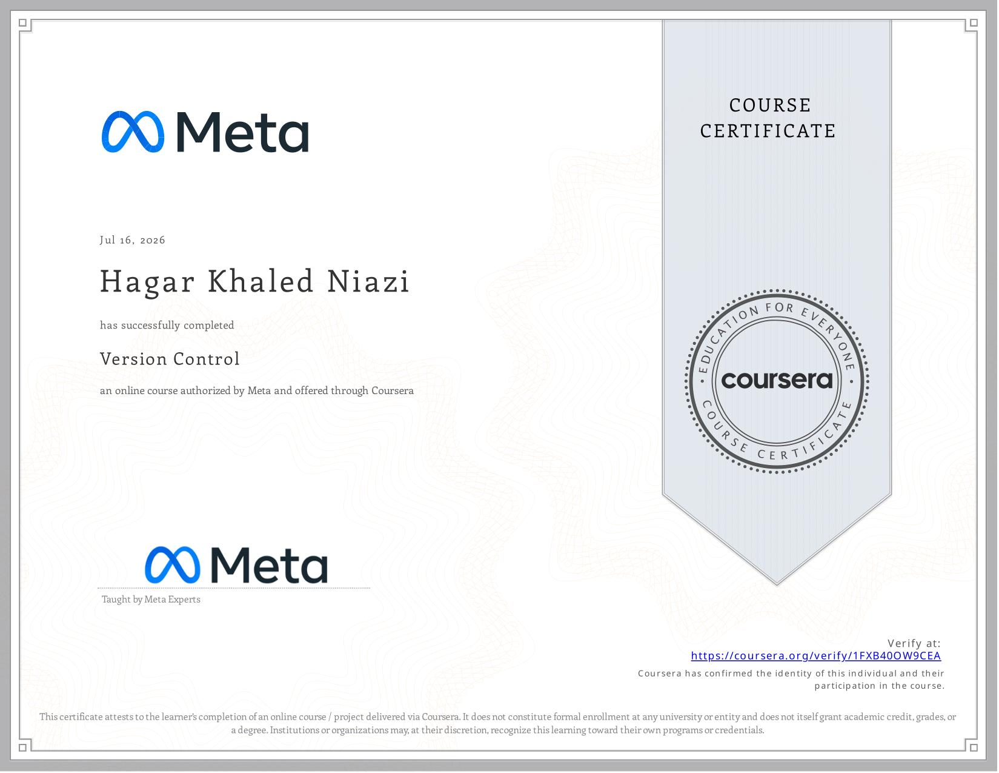

# Managing a Project in GitHub

A Git and GitHub-based project completed as part of the **Meta Front-End Developer Professional Certificate**.

This project focuses on practicing GitHub repository management, forking, cloning, editing files, inspecting changes with `git diff`, committing changes, and pushing updates to a remote repository.

## 🎯 Project Overview

The project demonstrates a basic GitHub workflow for managing changes to a project.

The repository was forked from the course repository, cloned locally, and the `class.txt` file was updated with a new list of colors.

The project demonstrates the following workflow:

* Fork a GitHub repository
* Clone the forked repository
* Edit a project file
* Inspect file changes using `git diff`
* Stage the changes
* Commit the changes
* Push the commit to GitHub

## ✏️ File Update

The `class.txt` file was updated by replacing three colors from the original file:

| Original | Updated  |
| -------- | -------- |
| Green    | Blue     |
| Ivory    | Charcoal |
| Gray     | Purple   |

The final file contains:

```text
Crimson
Orange
Blue
Cyan
Yellow
Charcoal
Khaki
Coral
Silver
Fuchsia
Purple
Brown
Red
```

## 🛠️ Technologies

* Git
* GitHub
* GitHub CLI
* PowerShell
* VS Code

## 📂 Project Structure

```text
Project-graduation-course3/
├── class.txt
└── README.md
```

## 💻 Git Commands Practiced

### GitHub Authentication

```bash
gh auth login
```

Used to authenticate GitHub CLI with the GitHub account.

### Clone Repository

```bash
gh repo clone <USERNAME>/<REPOSITORY-NAME>
```

Used to clone the forked repository to the local machine.

### Check Changes

```bash
git diff
```

Used to inspect which lines were deleted and which lines were added.

### Stage Changes

```bash
git add class.txt
```

Used to stage the modified file for the next commit.

### Commit Changes

```bash
git commit -m "Update class.txt"
```

Used to create a commit containing the changes.

### Push Changes

```bash
git push
```

Used to upload the commit to the remote GitHub repository.

## 🧠 Concepts Practiced

* GitHub repositories
* Forking repositories
* Cloning repositories
* GitHub CLI
* Git authentication
* Git working tree
* Tracking file changes
* `git diff`
* Staging changes
* Git commits
* Git push
* Remote repositories
* Basic Git workflow

## 🎓 Course

**Meta Front-End Developer Professional Certificate**

**Course 3 — Version Control**

Status: ✅ Completed

## 📜 Certificate

Certificate of completion for **Course 3 — Version Control**.



## 👩‍💻 Author

**Hagar Khaled Niazi**

Front-End Developer in progress.
