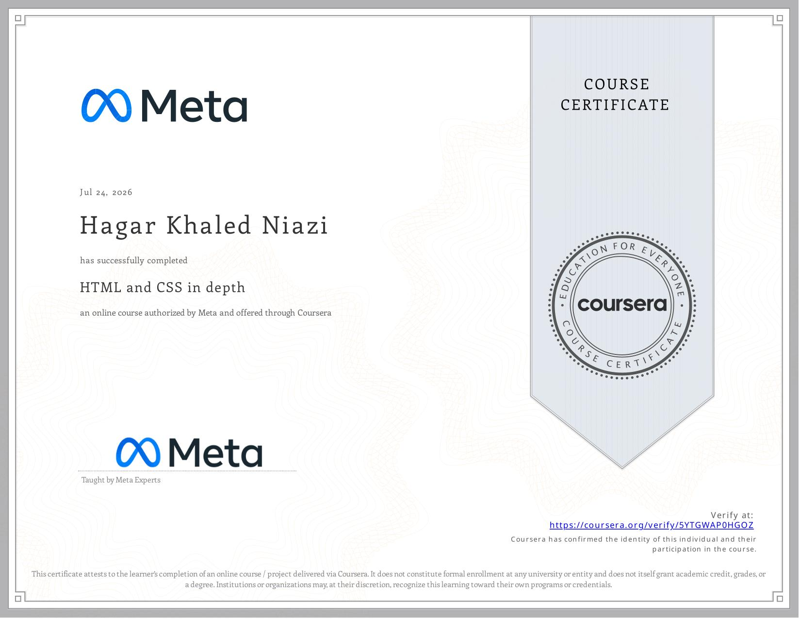

# Mangata & Gallo — Luxury Jewelry Website

A responsive luxury jewelry website built with **HTML5 and CSS3** as part of the **Meta Front-End Developer Professional Certificate**.

This project focuses on building a semantic, accessible, and responsive webpage for **Mangata & Gallo**, a fictional luxury jewelry brand specializing in jewelry for engagements, weddings, anniversaries, and other special occasions.

## 🎯 Project Overview

The project is a single-page luxury jewelry website designed to showcase the Mangata & Gallo brand and its jewelry collections.

The website includes:

* A branded header with logo and navigation
* A hero section with promotional content
* An About section
* A jewelry collections section
* Reusable collection cards
* A contact call-to-action section
* A responsive footer
* Responsive layouts for desktop, tablet, and mobile devices
* Hover interactions and subtle animations
* Accessibility considerations including semantic HTML, descriptive image `alt` text, keyboard focus states, and reduced-motion support

## ✨ Features

### Header & Navigation

The header includes:

* Mangata & Gallo logo
* Main navigation links
* Smooth scrolling between sections
* Hover effects
* Visible keyboard focus states

Navigation links:

* Home
* About
* Collections
* Contact

### 🖼️ Hero Section

The hero section introduces the brand with:

* Brand name
* Main headline
* Supporting description
* Call-to-action button

The CTA directs users to the jewelry collections section.

### 💎 Jewelry Collections

The website presents three featured collections:

| Collection          | Description                                            |
| ------------------- | ------------------------------------------------------ |
| Engagement Rings    | Elegant rings representing love and commitment         |
| Wedding Collection  | Timeless jewelry designed for special wedding moments  |
| Anniversary Jewelry | Sophisticated pieces celebrating meaningful milestones |

Each collection card includes:

* Collection image
* Collection title
* Description
* "Discover More" link
* Hover animation

### 📩 Contact Section

A dedicated call-to-action section encourages visitors to get in touch with the brand.

The contact button uses a `mailto:` link to provide a direct way to contact Mangata & Gallo.

### 📱 Responsive Design

The website is responsive across different screen sizes.

Three layouts are supported:

* Desktop
* Tablet
* Mobile

CSS media queries adjust:

* Navigation layout
* Typography
* Section spacing
* Collection grid
* Card sizes
* Footer layout
* Hero section dimensions

## ♿ Accessibility

Accessibility was considered throughout the project.

The website includes:

* Semantic HTML5 elements such as `<header>`, `<nav>`, `<main>`, `<section>`, `<article>`, and `<footer>`
* Descriptive `alt` text for images
* `aria-label` for the main navigation
* Keyboard-accessible focus states using `:focus-visible`
* Reduced-motion support using `prefers-reduced-motion`

The reduced-motion media query minimizes animations and transitions for users who prefer reduced motion.

## 🎨 Design & Styling

The design uses a luxury-inspired visual style with:

* Neutral backgrounds
* Gold accent colors
* Serif typography for headings
* Sans-serif typography for supporting text
* Generous spacing
* Minimal borders and shadows
* Subtle hover interactions

The layout is built using modern CSS techniques including:

* CSS Grid
* Flexbox
* CSS `clamp()`
* CSS custom properties where applicable
* Media queries
* CSS transitions
* CSS animations

## 🛠️ Technologies

* HTML5
* CSS3
* CSS Grid
* Flexbox
* Responsive Web Design
* Semantic HTML
* Accessibility
* Git
* GitHub
* VS Code

## 📂 Project Structure

```text
Project-graduation-course4/
├── images/
│   ├── anniversary-jewelry.jpeg
│   ├── engagement-ring.jpeg
│   ├── hero-jewelry.png
│   ├── mangata-gallo-logo.png
│   ├── mangata-gallo-logo-small.png
│   └── wedding-jewelry.jpeg
├── HTML-and-CSS-in-depth-certification.jpg
├── index.html
├── style.css
└── README.md
```

## 💻 HTML Concepts Practiced

* HTML5 document structure
* Semantic HTML
* Headings hierarchy
* Navigation
* Links and anchors
* Images
* Alternative text
* Sections and articles
* Metadata
* Accessibility attributes
* `mailto:` links

## 🎨 CSS Concepts Practiced

### Layout

* Flexbox
* CSS Grid
* Responsive layouts
* Centering and alignment
* Multi-column layouts

### Typography

* Font families
* Font sizes
* Font weights
* Letter spacing
* Line height
* Responsive typography using `clamp()`

### Responsive Design

```css
@media (max-width: 900px) {
    /* Tablet styles */
}

@media (max-width: 600px) {
    /* Mobile styles */
}
```

The layout changes from three columns on larger screens to two columns on tablets and one column on mobile devices.

### Animations & Interactions

The project includes:

* Hover effects
* CSS transitions
* Image scaling
* Card elevation effects
* Hero entrance animation
* Smooth scrolling

Example:

```css
.collection-card:hover {
    transform: translateY(-8px);
}
```

### Accessibility & Reduced Motion

```css
@media (prefers-reduced-motion: reduce) {
    *,
    *::before,
    *::after {
        animation-duration: 0.01ms !important;
        animation-iteration-count: 1 !important;
        transition-duration: 0.01ms !important;
    }
}
```

## 🧠 Concepts Practiced

* Semantic HTML
* Accessible web structure
* Responsive web design
* CSS Grid
* Flexbox
* CSS media queries
* CSS transitions
* CSS animations
* Hover states
* Keyboard focus states
* Responsive typography
* Image optimization and presentation
* Website layout and visual hierarchy
* Basic Git and GitHub workflow

## 🎓 Course

**Meta Front-End Developer Professional Certificate**

**Course 4 — HTML and CSS in Depth**

Status: ✅ Completed

## 📜 Certificate

Certificate of completion for **Course 4 — HTML and CSS in Depth**.

The certificate is included in this repository:



## 👩‍💻 Author

**Hagar Khaled Niazi**

Front-End Developer in progress.
