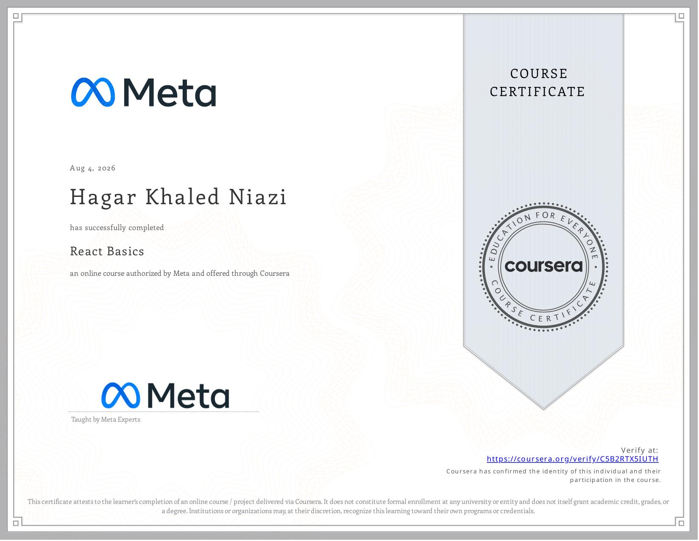

# React Calculator App

A simple and interactive calculator application built with **React** as part of the **Meta Front-End Developer Professional Certificate**.

This project demonstrates the use of React state management, references, event handlers, and basic arithmetic operations to build a functional calculator application.

## 🎯 Project Overview

The project is a React-based calculator that allows users to perform the four basic mathematical operations:

* Addition
* Subtraction
* Multiplication
* Division

The application also provides functionality to reset the input field and reset the displayed result.

## ✨ Features

### ➕ Addition

Adds the number entered by the user to the current result.

For example:

```text
Result: 10
Input: 5

10 + 5 = 15
```

### ➖ Subtraction

Subtracts the number entered by the user from the current result.

```text
Result: 15
Input: 5

15 - 5 = 10
```

### ✖️ Multiplication

Multiplies the current result by the number entered by the user.

```text
Result: 10
Input: 3

10 × 3 = 30
```

### ➗ Division

Divides the current result by the number entered by the user.

```text
Result: 30
Input: 5

30 ÷ 5 = 6
```

The application also handles division by zero by displaying an alert instead of performing the calculation.

### 🔄 Reset Input

Clears the number currently entered in the input field without changing the current result.

### 🔄 Reset Result

Resets the displayed calculation result back to `0`.

## 🧠 React Concepts Practiced

### `useState`

The project uses React's `useState` hook to manage the calculator result.

```jsx
const [result, setResult] = useState(0);
```

The result starts at `0` and is updated whenever an arithmetic operation is performed.

### `useRef`

The `useRef` hook is used to access the input element directly and retrieve the value entered by the user.

```jsx
const inputRef = useRef(null);
```

The input value can then be accessed with:

```jsx
inputRef.current.value
```

### Event Handling

The calculator uses React event handlers to connect buttons with their corresponding operations.

```jsx
<button onClick={plus}>add</button>
```

Each calculator operation is handled by a separate function.

### `e.preventDefault()`

The application uses `preventDefault()` to prevent the form from refreshing the page when a calculator button is clicked.

```jsx
e.preventDefault();
```

### Number Conversion

Input values are converted from strings to numbers using JavaScript's `Number()` function.

```jsx
Number(inputVal)
```

This allows the application to perform mathematical calculations correctly.

## 🛡️ Division by Zero

The division function checks whether the input value is `0` before performing the calculation.

```jsx
if (inputVal === 0) {
    alert("Cannot divide by zero");
    return;
}
```

This prevents the calculator from producing an invalid result such as `Infinity`.

## 🎨 User Interface

The calculator uses a simple and clean interface consisting of:

* Calculator heading
* Current result display
* Number input field
* Addition button
* Subtraction button
* Multiplication button
* Division button
* Reset input button
* Reset result button

The interface is styled using CSS with simple spacing, borders, typography, and button styling.

## 🛠️ Technologies

* React
* JavaScript
* JSX
* CSS3
* HTML5
* React Hooks

  * `useState`
  * `useRef`
* Event Handling
* npm
* Create React App
* VS Code
* Git
* GitHub

## 📂 Project Structure

```text
project-graduation-course5/
├── public/
│   ├── favicon.ico
│   ├── index.html
│   ├── logo192.png
│   ├── logo512.png
│   ├── manifest.json
│   └── robots.txt
│
├── src/
│   ├── App.css
│   ├── App.js
│   ├── App.test.js
│   ├── index.css
│   ├── index.js
│   ├── logo.svg
│   └── reportWebVitals.js
│
├── .gitignore
├── package.json
├── package-lock.json
└── README.md
```

## ▶️ Running the Project

### 1. Install dependencies

After cloning or downloading the project, open the project folder in VS Code and run:

```bash
npm install
```

### 2. Start the development server

Run:

```bash
npm start
```

The application will be available at:

```text
http://localhost:3000
```

The development server automatically reloads the application when source files are changed.

## 🧪 Testing the Calculator

The following operations were tested:

| Operation        | Example      | Expected Result |
| ---------------- | ------------ | --------------: |
| Addition         | 10 + 5       |              15 |
| Subtraction      | 15 - 5       |              10 |
| Multiplication   | 10 × 3       |              30 |
| Division         | 30 ÷ 5       |               6 |
| Division by zero | 10 ÷ 0       |           Alert |
| Reset Input      | Clear input  |   Input cleared |
| Reset Result     | Reset result |               0 |

## 📋 Success Checklist

* [x] React application created from scratch
* [x] Application runs using `npm start`
* [x] Result starts at `0`
* [x] Addition works correctly
* [x] Subtraction works correctly
* [x] Multiplication works correctly
* [x] Division works correctly
* [x] Division by zero is handled with an alert
* [x] Input field can be reset
* [x] Result can be reset
* [x] `useState` is used for result management
* [x] `useRef` is used to access the input field
* [x] Buttons use `onClick` event handlers
* [x] `preventDefault()` prevents form submission and page refresh

## 🎓 Course

**Meta Front-End Developer Professional Certificate**

**Course 5 — React Basics**

Status: ✅ Completed

## 📚 Learning Outcomes

Through this project, I practiced:

* Building a React application from scratch
* Creating and rendering React components
* Managing state with `useState`
* Accessing DOM elements with `useRef`
* Handling user interactions with event handlers
* Working with forms in React
* Performing mathematical operations with JavaScript
* Handling edge cases such as division by zero
* Connecting UI elements with application logic
* Running and testing a React application locally

## 📜 Certificate

Certificate of completion for **Course 4 — HTML and CSS in Depth**.

The certificate is included in this repository:



## 👩‍💻 Author

**Hagar Khaled Niazi**

Front-End Developer in progress.
