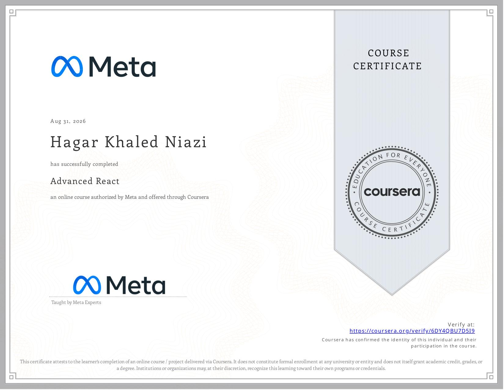

# React Developer Portfolio

A responsive developer portfolio website built with **React** as part of the **Meta Front-End Developer Professional Certificate — Course 6: Advanced React**.

This project demonstrates React component composition, reusable components, state management, form handling, validation, responsive layouts, navigation, and UI development using Chakra UI.

## 🎯 Project Overview

The project is a personal developer portfolio designed to showcase projects, social profiles, and contact information.

The portfolio includes:

- A responsive navigation header
- Social media links
- A hero section
- A projects showcase
- Project cards with images and external links
- A contact form with validation
- Success and error feedback
- A responsive footer

## ✨ Features

### 🧭 Responsive Header

The header provides links to:

- GitHub
- LinkedIn
- Frontend Mentor
- Instagram
- Dev.to
- Projects section
- Contact Me section

The header automatically hides when the user scrolls down and reappears when scrolling back up.

### 👩‍💻 Hero Section

The hero section introduces the developer with:

- Profile avatar
- Developer name
- Front-end developer title
- React specialization

Example:

```text
Hello, I am Hagar!

A frontend developer specialised in React
````

### 📂 Projects Section

The projects section displays four projects using reusable React components.

Projects included:

* To-Do List
* E-Commerce Website
* Elzero HTML & CSS Project
* Kasper Creative Agency

Each project card contains:

* Project image
* Project title
* Description
* External project link

Projects are rendered dynamically using JavaScript's `map()` method.

```jsx
{projects.map((project) => (
  <Card
    key={project.id}
    title={project.title}
    description={project.description}
    image={project.image}
    link={project.link}
  />
))}
```

### 📨 Contact Form

The contact section provides a form where visitors can submit:

* Name
* Email address
* Type of enquiry
* Message

The form uses **Formik** for form management and **Yup** for validation.

Validation includes:

* Required name
* Valid email address
* Required enquiry type
* Required message
* Minimum 25 characters for the message

### ✅ Form Submission Feedback

After submitting the form, the application simulates a server request.

The user receives either:

* A success message
* An error message

When submission succeeds, the form is automatically reset.

### 📱 Responsive Design

The application uses Chakra UI responsive properties to adapt the layout to different screen sizes.

The projects section uses a responsive grid that adapts between smaller and larger screens.

## 🧠 React Concepts Practiced

### 🧩 Component-Based Architecture

The application is divided into reusable React components:

```text
App
├── Header
├── Hero
├── Projects
│   └── Card
├── ContactMe
└── Footer
```

This keeps the application organized and makes individual UI sections reusable and easier to maintain.

### 📦 Props

Project information is passed from the `Projects` component to the reusable `Card` component using props.

```jsx
<Card
  title={project.title}
  description={project.description}
  image={project.image}
  link={project.link}
/>
```

### 🔄 useState

The `useState` hook is used to manage component state.

For example, the header uses state to control its visibility:

```jsx
const [showHeader, setShowHeader] = useState(true);
```

### 🎣 useEffect

The `useEffect` hook is used to listen for window scroll events.

```jsx
useEffect(() => {
  const handleScroll = () => {
    // Detect scroll direction
  };

  window.addEventListener("scroll", handleScroll);

  return () => window.removeEventListener("scroll", handleScroll);
}, []);
```

The event listener is removed when the component is unmounted.

### 🎯 useRef

The `useRef` hook is used to keep track of the previous scroll position.

```jsx
const lastScrollY = useRef(0);
```

This allows the application to detect whether the user is scrolling up or down.

### 📝 Formik

Formik is used to manage the contact form.

```jsx
const formik = useFormik({
  initialValues: {
    firstName: "",
    email: "",
    type: "",
    comment: "",
  },
  validationSchema: ContactSchema,
  onSubmit: ...
});
```

Formik handles:

* Form values
* Input changes
* Validation
* Submission
* Form resetting
* Submission state

### 🛡️ Yup Validation

Yup is used to define the form validation schema.

```jsx
const ContactSchema = Yup.object({
  firstName: Yup.string().required("Required"),
  email: Yup.string()
    .required("Required")
    .email("Invalid email address"),
  type: Yup.string().required("Required"),
  comment: Yup.string()
    .required("Required")
    .min(25, "Must be at least 25 characters"),
});
```

### 🎨 Chakra UI

The application uses Chakra UI for building the interface and responsive layouts.

Examples include:

* `Box`
* `Flex`
* `Heading`
* `Text`
* `Avatar`
* `SimpleGrid`
* `Button`
* `Input`
* `Select`
* `Textarea`
* `Alert`

## 🛠️ Technologies

* React
* JavaScript
* JSX
* HTML5
* CSS
* Chakra UI
* Formik
* Yup
* React Icons
* Framer Motion
* React Hooks

  * `useState`
  * `useEffect`
  * `useRef`
* npm
* Create React App
* VS Code
* Git
* GitHub

## 📂 Project Structure

```text
project-graduation-course6/
├── public/
│
├── src/
│   ├── assets/
│   │   ├── avatar.jpg
│   │   └── projects/
│   │
│   ├── components/
│   │   ├── Card.js
│   │   ├── ContactMe.js
│   │   ├── Footer.js
│   │   ├── Header.js
│   │   ├── Hero.js
│   │   └── Projects.js
│   │
│   ├── data/
│   │   ├── projects.js
│   │   └── socials.js
│   │
│   ├── App.js
│   └── index.js
│
├── .gitignore
├── package.json
├── package-lock.json
└── README.md
```

## ▶️ Running the Project

### 1. Install dependencies

After cloning the repository, open the project folder in VS Code and run:

```bash
npm install
```

### 2. Start the development server

Run:

```bash
npm start
```

The application will be available at:

```text
http://localhost:3000
```

The development server automatically reloads the application when source files are changed.

## 🧪 Testing the Project

The following functionality was tested:

| Feature                | Expected Result                                           |
| ---------------------- | --------------------------------------------------------- |
| Header navigation      | Navigates to the correct sections                         |
| Social links           | Opens the correct external profile                        |
| Header scroll behavior | Hides when scrolling down and reappears when scrolling up |
| Hero section           | Displays profile information                              |
| Projects section       | Displays project cards                                    |
| Project links          | Open external project pages                               |
| Contact form           | Accepts user input                                        |
| Empty fields           | Validation messages appear                                |
| Invalid email          | Email validation message appears                          |
| Short message          | Minimum length validation appears                         |
| Successful submission  | Success message is displayed and form resets              |
| Failed submission      | Error message is displayed                                |

## 📋 Success Checklist

* React portfolio application created
* Reusable React components created
* Header component implemented
* Hero section implemented
* Projects section implemented
* Reusable project card component implemented
* Contact form implemented
* Form validation implemented with Yup
* Form management implemented with Formik
* Success and error feedback implemented
* Responsive layout implemented with Chakra UI
* Social media links added
* Frontend Mentor link added
* Header scroll behavior implemented
* `useState` practiced
* `useEffect` practiced
* `useRef` practiced
* Project data rendered dynamically using `map()`
* External project links implemented
* Application runs using `npm start`

## 🎓 Course

**Meta Front-End Developer Professional Certificate**

**Course 6 — Advanced React**

Status: ✅ Completed

## 📚 Learning Outcomes

Through this project, I practiced:

* Building a React application using reusable components
* Structuring a React application into multiple components
* Passing data through props
* Rendering lists dynamically with `map()`
* Managing component state with `useState`
* Handling side effects with `useEffect`
* Using `useRef` for persistent values
* Building responsive interfaces with Chakra UI
* Creating and validating forms with Formik and Yup
* Handling form submission states
* Providing success and error feedback
* Creating accessible navigation
* Working with external links and social media icons
* Organizing application data separately from UI components
* Running and testing a React application locally

## 📜 Certificate

Certificate of completion for **Course 6 — Advanced React**.

The certificate is included in this repository:



## 👩‍💻 Author

**Hagar Khaled Niazi**

Front-End Developer in progress.